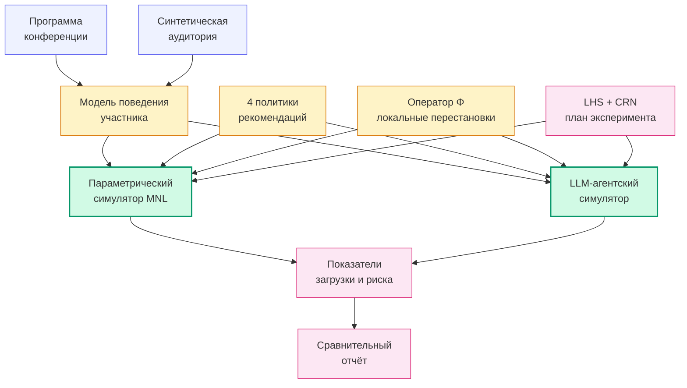

# Разработка интеллектуальной системы поддержки формирования программы конференции

#### Сценарный стресс-тест программы при отсутствии данных о посещаемости

Магистерская выпускная квалификационная работа · Индустриальный трек

**Пушков Фёдор Владимирович** · Университет ИТМО · 2026

<!--
Меня зовут Фёдор Пушков, тема работы — разработка интеллектуальной системы поддержки формирования программы конференции. Работа выполнена на индустриальном треке.
-->

---
layout: top-title
color: bluegreen-light
---

:: title ::

Проблема

:: content ::

При формировании программы конференции с параллельными сессиями организатор не знает, как фактическая аудитория распределится между залами.

**Однократность события**

Программа и аудитория уникальны; прогноз с одной конференции на другую не переносится.

**Нет attendance-данных**

Систематический канал сбора фактической посещаемости отсутствует.

**Поздний сигнал**

Часть выбора участником докладов происходит в день конференции.

Результат — перегрузка отдельных залов: ожидаемое число участников доклада превышает вместимость зала, в котором он проходит.

<!--
Три барьера: однократность, отсутствие данных, поздний выбор. Прогнозную модель построить не на чем.
-->

---
layout: top-title
color: bluegreen-light
---

:: title ::

Класс задачи: глубокая неопределённость

:: content ::

#### Не прогноз — сценарный анализ

В литературе по поддержке решений такой класс задач решается **сценарным подходом** (Robust Decision Making, DMDU).

Вместо точечного прогноза — выборка правдоподобных сценариев; для каждой стратегии оценивается её устойчивость на всём множестве.

**Каноны:** Lempert, Popper, Bankes (2003); Marchau и соавт. (2019); Kwakkel (2017).

**Аналогия защиты**

Не прогноз погоды, а **стресс-тест здания**.

Не «какой будет ветер», а «при каком ветре что обвалится».

<!--
Главный методический сдвиг: с прогноза на сценарный анализ.
-->

---
layout: top-title
color: bluegreen-light
---

:: title ::

Что нового — пять осей gap-анализа

:: content ::

| # | Ось | Линии работ в литературе |
|---|---|---|
| 1 | Постановка без attendance-данных | Vangerven 2018, Rezaeinia 2024, Pylyavskyy 2024 — преференции считаются известными |
| 2 | Учёт вместимости как первичный критерий | ReCon 2023, FEIR 2024 — другие домены (вакансии, POI) |
| 3 | Совместное сравнение политик и вариантов программы | Раздельно: scheduling vs recsys |
| 4 | Два независимых механизма отклика | Park 2023, Agent4Rec, OASIS — только LLM |
| 5 | Сценарная робастность как критерий | DMDU-канон — другие домены |

**Вклад работы:** система поддержки принятия решений на пересечении пяти осей; в открытой литературе работ, закрывающих их одновременно, не найдено.

<!--
В литературе по каждой оси отдельные работы. Совмещения пяти осей в одной задаче не нашёл.
-->

---
layout: top-title
color: bluegreen-light
---

:: title ::

Архитектура системы

:: content ::

Девять модулей · единственный фактический вход — программа конференции · сердце системы — два независимых симулятора отклика

<!--
Сердце системы — два независимых симулятора отклика; работают через общий контракт политики.
-->

---
layout: top-title
color: bluegreen-light
---

:: title ::

Модель отклика участника

:: content ::

$$
U(t) = w_{rel}\cdot\mathrm{rel}(u,t) + w_{rec}\cdot\mathbf{1}\{t\in\mathrm{recs}\} + w_{gossip}\cdot\frac{\log(1+n_t)}{\log(1+N)}
$$

#### Распределение выбора

$$
P(t) = \mathrm{softmax}\bigl(U/\tau\bigr)
$$

Симплекс весов: $w_{rel} + w_{rec} + w_{gossip} = 1$.

Параметр стохастичности $\tau$ фиксирован при настройке.

**Ключевое решение: capacity вынесена из utility в политику**

- В первой реализации capacity-штраф был в utility — это нарушало граничное свойство «при $w_{rec}\to 0$ политики неразличимы».
- В принятой версии capacity-учёт — **одна из политик** семейства (П3), а не свойство модели поведения.

<!--
Три канала, симплекс весов, capacity вынесена в политику — граничная верификация выполняется по построению.
-->

---
layout: top-title
color: bluegreen-light
---

:: title ::

План эксперимента

:: content ::

#### Латинский гиперкуб по 6 осям

1. вместимость залов
2. модель популярности
3. вес $w_{rec}$
4. вес $w_{gossip}$
5. размер аудитории
6. вариант программы (оператор $\Phi$)

Политика — отдельная ось, полный перебор внутри точки.

McKay, Beckman, Conover (1979); Kleijnen (2005).

#### Объёмы прогонов

**Параметрический симулятор**

50 точек × 4 политики × 3 seed = **486 evals**

**LLM-агентский симулятор**

12 maximin × 4 политики × 1 seed = **48 evals**

44 160 LLM-вызовов

**Общие случайные числа** внутри точки: все политики работают на одной синтетической аудитории.

<!--
LHS + CRN снимают шум попарного сравнения политик внутри одной точки гиперкуба.
-->

---
layout: top-title
color: bluegreen-light
---

:: title ::

Граничная верификация модели

:: content ::

**EC1 ✓** При множителе вместимости $\geq 3.0$ риск перегрузки $= 0$ для всех политик

**EC2 ✓** Монотонность: при уменьшении вместимости риск не убывает

**EC3 ✓** При $w_{rec}=0$ протоколы прогонов разных политик пословно совпадают

**EC4 ✓** При $w_{rec}=1$ размах между политиками существенно превосходит шум

**+6 расширений ✓** Те же свойства при ненулевом $w_{gossip}$ + монотонность концентрации

**ИТОГО:** **10 / 10 PASS**

**Блокирующий фильтр** перед содержательными выводами [Sargent, 2013]. До прохождения четырёх обязательных свойств анализ результатов блокируется. На текущей реализации все свойства выполняются.

<!--
Блокирующий фильтр. До его прохождения никакие сравнительные выводы не интерпретируются.
-->

---
layout: top-title
color: bluegreen-light
---

:: title ::

Главные численные результаты

:: content ::

#### Попарное сравнение · 50 точек · $\varepsilon = 0.005$

| Пара | win | ties | loss |
|---|---:|---:|---:|
| no_policy vs cosine | **0.14** | 0.86 | 0.00 |
| no_policy vs capacity_aware | 0.00 | 0.86 | **0.14** |
| **cosine vs capacity_aware** | **0.00** | 0.78 | **0.22** |

**cosine не выигрывает у capacity_aware** ни на одной из 50 точек — ни строго, ни за $\varepsilon$.

#### Risk-positive подмножество · 13 / 50

| Точка | вмест. | ауд. | cosine | cap_aware |
|---:|---:|---:|---:|---:|
| 26 | 0.629 | 60 | 0.171 | **0.004** |
| 49 | 0.774 | 100 | 0.545 | **0.356** |
| 35 | 0.963 | 100 | 0.061 | **0.003** |
| 18 | 1.040 | 60 | 0.021 | **0.000** |

capacity_aware **не уступает** max(no_policy, cosine) на 13 / 13 точек в пределах $\varepsilon$ и **строго снижает риск** на **11 / 13 (85 %)**.

Средняя релевантность между политиками — различие $< 0.002$.

<!--
Центральный результат. cosine не превзойдён ни в одной точке за ε; на risk-positive строгий выигрыш в 11/13.
-->

---
layout: top-title
color: bluegreen-light
---

:: title ::

Сверка двух симуляторов

:: content ::

#### Согласованность на 12 общих точках

| Показатель | $n$ невырожд. | $\rho$ медиана | top-1 lead |
|---|---:|---:|---:|
| средняя релевантность | 12 | **0.80** | 11 / 12 |
| дисперсия загрузки | 12 | 0.40 | 11 / 12 |
| доля переполнений | 2 | 0.74 | 2 / 2 |
| превышение вместимости | 2 | 0.30 | 2 / 2 |

Объединённая медиана $\rho = 0.554 \geq 0.5$ — формальный порог пройден.

#### Честная интерпретация

- **Релевантность** — уверенно согласована (12 / 12 точек).
- **Метрики переполнения** опираются на **2 / 12 невырожденных точек**: 74 % LHS-точек структурно безопасны → ранжирование вырождено.
- Это **диагностика**, не сильная валидация.

Канон validation для LLM-симуляторов = distribution-match, не индивидуальная точность. **«Believability ≠ validity»** [Larooij & Törnberg, 2025].

<!--
Симуляторы согласуются по релевантности. По метрикам переполнения — узкая выборка, структурное свойство сценарного анализа.
-->

---
layout: top-title
color: bluegreen-light
---

:: title ::

Ограничения и направления развития

:: content ::

#### Ограничения как условия задачи

- Одна основная конференция (Mobius 2025 Autumn); перенос на другие требует проверки.
- Аудитория синтетическая; калибровка на real attendance вне обязательного результата.
- LLM-симулятор — 12 точек, экономичная модель `gpt-5.4-nano`.
- Оператор $\Phi$ — ось эксперимента, не оптимизатор расписания.
- Численные значения — сравнительные внутри модели, не прогноз.

#### Направления развития

- Целевой эксперимент по эффекту $\Phi$ при фиксированных остальных осях — переход от диагностики к причинной оценке.
- Расширение LLM-выборки с большей долей risk-positive точек.
- Прогон на программах конференций других форматов.
- Калибровка модели поведения при появлении канала фактических данных.
- A/B-проверка на следующем инстансе конференций сообщества JUG.

<!--
Ограничения зафиксированы как условия задачи, не как защитная оговорка.
-->

---
layout: top-title
color: bluegreen-light
---

:: title ::

Выводы

:: content ::

#### Что разработано

- **Постановка** задачи сценарной оценки риска перегрузки залов при отсутствии attendance-данных.
- **Программная система** из 9 модулей с двумя независимыми симуляторами отклика.
- **План эксперимента** на латинском гиперкубе с общими случайными числами.
- **Сравнительный отчёт** для организатора — карта загрузки, горячие точки, попарные сравнения политик, сценарные характеристики оси $\Phi$.

#### Ключевые числа

**10 / 10** граничных тестов PASS

**cosine не выигрывает** у capacity_aware ни на одной из 50 точек за $\varepsilon$

На risk-positive: **11 / 13** точек строгого снижения риска

trade-off риск × релевантность — **7.3 %** комбинаций

<!--
Спасибо за внимание. Готов к вопросам.
-->

---
layout: end
color: bluegreen-light
---

# Спасибо

#### Готов к вопросам

Пушков Фёдор Владимирович · Университет ИТМО · 2026

