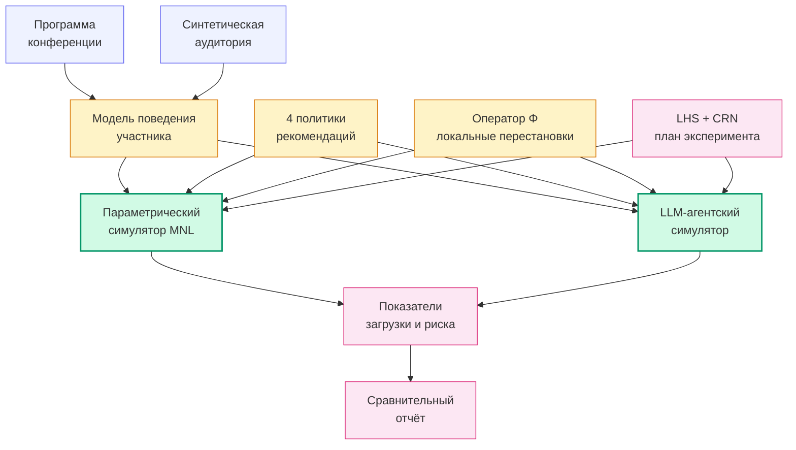

# Разработка интеллектуальной системы поддержки формирования программы конференции

#### Сценарная оценка риска перегрузки залов при формировании программы

Магистерская выпускная квалификационная работа · Индустриальный трек

Пушков Фёдор Владимирович · Университет ИТМО · 2026

<!--
Тема работы — разработка интеллектуальной системы поддержки формирования программы конференции, защита идёт на индустриальном треке. Содержательно работа отвечает на вопрос, как организатору оценивать риск перегрузки залов на стадии планирования программы, когда данных о фактической посещаемости нет и быть не может.
-->

---
layout: top-title
color: bluegreen-light
---

:: title ::

Проблема

:: content ::

При формировании программы конференции с параллельными сессиями организатор не знает, как фактическая аудитория распределится между залами. Прогнозную модель посещаемости построить в этих условиях нельзя; причин этому несколько, и они действуют одновременно.

Каждая конференция уникальна по составу программы и аудитории, поэтому прогноз, обученный на одной, не переносится на следующую.

Систематического канала сбора фактической посещаемости в индустрии нет, поэтому обучающей выборки взять неоткуда.

Значительная часть выбора между параллельными докладами происходит уже в день конференции, и сигнал о фактическом выборе раскрывается слишком поздно, чтобы повлиять на программу.

В этих условиях возникает риск перегрузки отдельных залов: ожидаемое число желающих посетить конкретный доклад превышает вместимость зала, в котором он проходит. С этим риском и работает разрабатываемая система.

<!--
Постановка задачи: организатор формирует программу, не имея данных о реальной посещаемости и не имея способа эти данные заблаговременно получить. Прогнозную модель строить не на чем по трём причинам: каждая конференция уникальна, систематического канала данных нет, сигнал о фактическом выборе раскрывается слишком поздно. Поэтому возникает риск перегрузки отдельных залов: на доклад приходит больше желающих, чем мест в зале. Именно работа с этим риском составляет содержание защищаемой системы.
-->

---
layout: top-title
color: bluegreen-light
---

:: title ::

Класс задачи и положение в литературе

:: content ::

Если прогноз построить невозможно, задача методически смещается в другой класс — туда, где прогноз вообще не строят. Этот класс известен в литературе как робастное принятие решений: вместо точечного предсказания строится выборка правдоподобных сценариев, и каждое решение проверяется на устойчивость ко всему набору. Подход восходит к работам корпорации RAND (Лемперт, Поппер, Бэнкс, 2003); современное изложение — Марчау с соавторами (2019).

| # | Направление | Линии работ в литературе |
|---|---|---|
| 1 | Постановка без данных о посещаемости | Вангервен 2018, Резейния 2024, Пыляфский 2024 — преференции участников считаются известными заранее |
| 2 | Учёт вместимости залов как первичный критерий | ReCon 2023, FEIR 2024 — реализуются в других предметных областях (вакансии, точки интереса) |
| 3 | Совместное сравнение политик рекомендаций и вариантов программы | Эти задачи в литературе обычно решаются в разных линиях исследований |
| 4 | Два независимых механизма моделирования отклика | Парк 2023, Agent4Rec, OASIS — используется только агентский подход на языковых моделях |
| 5 | Сценарная робастность как критерий выбора политики | Канон робастного принятия решений применяется в других предметных областях |

Сочетания всех пяти направлений в одной системе для задачи формирования программы конференции в открытой литературе на момент исследования не зафиксировано. Этим определяется научная новизна работы.

<!--
Если прогноз построить невозможно, задача методически смещается в другой класс — туда, где прогноз вообще не строят, а вместо него строят выборку правдоподобных сценариев и проверяют устойчивость решения. Этот класс известен в литературе как робастное принятие решений (RAND, начало двухтысячных годов; систематизированный обзор у Марчау с соавторами 2019). Работа располагается на пересечении пяти направлений: постановка без данных о посещаемости, учёт вместимости залов как первичного критерия, совместное сравнение политик и вариантов программы, два независимых механизма моделирования отклика, сценарная робастность как критерий выбора. По каждому направлению есть основательные работы; сочетания всех пяти в одной системе для задачи формирования программы конференции не зафиксировано — этим определяется научная новизна работы.
-->

---
layout: top-title
color: bluegreen-light
---

:: title ::

Симуляторы и параметры эксперимента

:: content ::

#### Два независимых симулятора аудитории

Параметрический симулятор работает в замкнутой форме мультиномиального логита: задаётся функция полезности доклада для участника, и выбор моделируется как softmax по полезности.

Агентский симулятор работает на основе языковой модели: каждому участнику соответствует отдельный экземпляр языковой модели с профилем-персоной, который последовательно принимает решения о посещении докладов.

Симуляторы взаимозаменяемы через единый программный контракт политики рекомендаций. Это позволяет проводить перекрёстную проверку выводов: одно и то же сравнение политик прогоняется на двух разных по форме симуляторах.

#### Параметры варьирования

Симуляторы прогоняют программу конференции через выборку параметрических конфигураций. Параметры разделены на две группы.

К параметрам аудитории и её поведения относятся численность аудитории, тематические интересы, вес следования рекомендации в выборе участника, вес социального заражения и источник оценки популярности доклада.

К физическим условиям программы — множитель вместимости залов и вариант программы, полученный локальными перестановками докладов между слотами одного дня.

<!--
В работе реализованы два независимых симулятора аудитории. Параметрический работает в замкнутой форме мультиномиального логита: задаётся функция полезности доклада для участника, и выбор моделируется как softmax. Агентский — на основе языковой модели: каждому участнику соответствует отдельный экземпляр модели с профилем-персоной, последовательно принимающий решения о посещении докладов. Симуляторы взаимозаменяемы через единый программный контракт политики рекомендаций — это и позволяет проводить перекрёстную проверку выводов. Симуляторы прогоняют программу конференции через выборку параметрических конфигураций. Параметры разделены на две группы. Первая — параметры аудитории и её поведения: численность, тематические интересы, веса следования рекомендации и социального заражения, источник оценки популярности докладов. Вторая — физические условия программы: множитель вместимости залов и вариант программы после локальных перестановок докладов между слотами одного дня.
-->

---
layout: top-title
color: bluegreen-light
---

:: title ::

Архитектура системы

:: content ::

Девять модулей с однонаправленными связями. Единственный фактический вход в систему — программа конференции; всё остальное либо моделируется, либо задаётся параметрами эксперимента.

<!--
Архитектурно — девять модулей. Единственный фактический вход — это программа конференции. Всё остальное либо моделируется (синтетическая аудитория, модель поведения участника, оценка популярности доклада), либо задаётся параметрами эксперимента (политика рекомендаций, вариант программы, размер аудитории, веса полезности). Два независимых механизма моделирования отклика — параметрический в замкнутой форме мультиномиального логита и агентский на языковой модели — работают через единый программный контракт политики, что и позволяет проводить перекрёстную проверку выводов.
-->

---
layout: top-title
color: bluegreen-light
---

:: title ::

Модель поведения участника

:: content ::

$$
U(t) = w_{rel}\cdot\mathrm{rel}(u,t) + w_{rec}\cdot\mathbf{1}\{t\in\mathrm{recs}\} + w_{gossip}\cdot\frac{\log(1+n_t)}{\log(1+N)}
$$

#### Распределение выбора

$$
P(t) = \mathrm{softmax}\bigl(U/\tau\bigr)
$$

Веса трёх каналов связаны симплексным условием $w_{rel} + w_{rec} + w_{gossip} = 1$. Это позволяет интерпретировать каждый из них как долю влияния соответствующего канала на итоговый выбор.

Параметр стохастичности $\tau$ фиксирован при настройке модели и не входит в варьируемые оси эксперимента.

#### Архитектурное решение по вместимости залов

Ограничение вместимости вынесено из функции полезности участника в одну из политик рекомендаций. В первой реализации штраф за загрузку зала входил в полезность напрямую, и это нарушало граничное свойство «при $w_{rec} \to 0$ политики рекомендаций становятся неразличимы». В принятой реализации учёт вместимости делает только одна политика семейства, а полезность от состояния зала не зависит.

<!--
Полезность доклада для участника складывается из трёх каналов: содержательная близость доклада к профилю участника, индикатор того, что доклад показан рекомендательной политикой, и социальный сигнал — какая часть когорты уже выбрала этот доклад к моменту принятия решения. Веса трёх каналов лежат на симплексе и интерпретируются как доли влияния. Ограничение вместимости намеренно не входит в полезность участника. Оно реализовано как одна из политик семейства; иначе нарушалось бы граничное свойство, по которому при нулевом весе рекомендации все политики обязаны быть неразличимыми.
-->

---
layout: top-title
color: bluegreen-light
---

:: title ::

План эксперимента

:: content ::

#### Латинский гиперкуб по шести осям

Латинский гиперкуб — стандартный план планирования имитационных экспериментов, обеспечивающий равномерное покрытие пространства параметров заданным числом точек. Шесть параметрических осей в работе:

1. множитель вместимости залов;
2. источник оценки популярности доклада;
3. вес рекомендации $w_{rec}$;
4. вес социального заражения $w_{gossip}$;
5. размер аудитории;
6. вариант программы (оператор локальных перестановок $\Phi$).

Политика рекомендаций — отдельная ось, перебираемая полным перебором внутри каждой точки.

Маккей, Бекман, Коновер (1979); Клейнен (2005).

#### Объёмы прогонов

Параметрический симулятор работает на полном плане: 50 точек гиперкуба, 4 политики, 3 повтора с разными случайными зёрнами — итого 486 запусков, бюджет в минутах процессорного времени.

Агентский симулятор на языковой модели работает на представительном подмножестве из 12 точек, отобранных по принципу максимизации попарной дистанции в пространстве конфигураций: 4 политики, одно случайное зерно — итого 48 запусков, около 44 тысяч обращений к языковой модели.

Внутри каждой точки гиперкуба все политики работают на одной и той же синтетической аудитории и одном и том же варианте программы. Этот приём (общие случайные числа) снимает шум попарного сравнения политик и оставляет только эффект самой политики.

<!--
План эксперимента построен на латинском гиперкубе по шести параметрическим осям. Внутри каждой точки гиперкуба применяется приём общих случайных чисел: все четыре политики работают на одной и той же синтетической аудитории и одном и том же варианте программы. Без этого приёма шум попарного сравнения политик скрывал бы или искусственно усиливал различия. Параметрический симулятор прогоняет полный план, агентский — только представительное подмножество из 12 точек, потому что обращения к языковой модели стоят дорого.
-->

---
layout: top-title
color: bluegreen-light
---

:: title ::

Граничная верификация модели

:: content ::

**EC1.** При множителе вместимости $\geq 3.0$ риск перегрузки нулевой для всех политик.

**EC2.** При уменьшении множителя вместимости риск перегрузки монотонно растёт.

**EC3.** При $w_{rec} = 0$ протоколы прогонов разных политик совпадают пословно.

**EC4.** При $w_{rec} = 1$ размах метрики между политиками существенно превосходит шум одной политики.

**Расширения.** Те же четыре свойства при ненулевом весе социального заражения и монотонность концентрации загрузки по этому весу — шесть дополнительных тестов.

10 из 10 проходят

Граничная верификация в крайних условиях оформлена как блокирующий фильтр: до прохождения обязательных свойств содержательный анализ результатов не интерпретируется (канон Сарджента, 2013). На реализованной версии модели все десять свойств выполняются.

<!--
Граничная верификация — это проверка корректности модели в условиях, в которых её поведение должно быть предсказуемым теоретически. Например, при заведомо избыточной вместимости риска перегрузки не должно быть ни при какой политике. При нулевом весе рекомендации все политики становятся равны, потому что компонента следования рекомендации в полезности обнуляется. Шесть дополнительных тестов проверяют те же свойства при ненулевом весе социального заражения, плюс монотонность концентрации загрузки. До прохождения всех десяти тестов численные сравнительные выводы не интерпретируются — это академический канон валидации имитационных моделей, восходящий к Сарджентом (2013).
-->

---
layout: top-title
color: bluegreen-light
---

:: title ::

Численные результаты сравнения политик

:: content ::

#### Полный план: 50 точек гиперкуба

Попарное сравнение политик с допуском равенства $\varepsilon = 0.005$ по показателю относительного превышения вместимости:

| Пара | побед | равенств | поражений |
|---|---:|---:|---:|
| контрольная vs по релевантности | 0.14 | 0.86 | 0.00 |
| контрольная vs с учётом вместимости | 0.00 | 0.86 | 0.14 |
| по релевантности vs с учётом вместимости | 0.00 | 0.78 | 0.22 |

Политика по релевантности не выигрывает у политики с учётом вместимости ни на одной из 50 точек — ни строго, ни в пределах допуска. Обратное направление: политика с учётом вместимости строго лучше в 22% точек.

#### Подмножество точек с риском перегрузки

В 37 из 50 точек гиперкуба переполнения нет ни у одной политики — это структурное свойство равномерного покрытия осей. Эффект политики наблюдается на оставшихся 13 точках:

| Точка | вмест. | ауд. | по релевантности | с учётом вместимости |
|---:|---:|---:|---:|---:|
| 26 | 0.629 | 60 | 0.171 | 0.004 |
| 49 | 0.774 | 100 | 0.545 | 0.356 |
| 35 | 0.963 | 100 | 0.061 | 0.003 |
| 18 | 1.040 | 60 | 0.021 | 0.000 |

На рисковом подмножестве политика с учётом вместимости не уступает альтернативам в пределах допуска во всех 13 точках; строго снижает риск перегрузки в 11 точках из 13 (85%).

Различие средней релевантности фактически выбранного доклада между политиками — менее 0.002 по абсолютному значению.

<!--
Это центральный численный результат работы. На полном плане из 50 точек политика по релевантности не выигрывает у политики с учётом вместимости ни в одной точке. На подмножестве из 13 точек, где переполнение вообще зафиксировано, политика с учётом вместимости строго снижает риск в 11 точках. Остальные 37 точек структурно безопасны: при равномерном покрытии оси множителя вместимости значительная часть точек попадает в режим избыточной вместимости, где переполнения не возникает физически. Снижение риска происходит без заметной потери содержательного качества рекомендаций: различие средней релевантности фактически выбранного доклада между политиками — менее 0.002.
-->

---
layout: top-title
color: bluegreen-light
---

:: title ::

Перекрёстная проверка двух симуляторов

:: content ::

#### Согласованность ранжирований политик

Перекрёстная проверка проведена на 12 общих точках гиперкуба. Сопоставлены ранжирования четырёх политик в параметрическом симуляторе и в агентском симуляторе на языковой модели по четырём показателям:

| Показатель | $n$ невырожденных | $\rho$ медиана | совпадение лидера |
|---|---:|---:|---:|
| средняя релевантность | 12 | 0.80 | 11 / 12 |
| дисперсия загрузки залов | 12 | 0.40 | 11 / 12 |
| доля переполнений | 2 | 0.74 | 2 / 2 |
| относительное превышение вместимости | 2 | 0.30 | 2 / 2 |

Объединённая медианная корреляция Спирмена $\rho = 0.554$, формальный порог 0.5 пройден.

#### Граница интерпретации

Согласованность по средней релевантности уверенная: на 12 точках из 12 ранжирования политик в двух симуляторах совпадают, лидер совпадает на 11 точках из 12.

Метрики переполнения опираются всего на 2 точки из 12 невырожденных. На остальных 10 параметрический симулятор даёт нулевое переполнение для всех политик, и ранговая корреляция там не определена. Это структурное свойство равномерной выборки, а не недостаток самих симуляторов. На имеющихся данных это диагностика согласованности, а не полная валидация.

В литературе по агентским симуляторам на языковых моделях каноническим способом валидации считается совпадение распределений, а не точность предсказания индивидуального выбора (Лароой и Тёрнберг, 2025). Достоверность поведения агента сама по себе не равна валидности модели.

<!--
Перекрёстная проверка проведена на 12 общих точках гиперкуба. Согласованность ранжирований политик по средней релевантности уверенная: корреляция 0.80, лидер совпадает на 11 точках из 12. По метрикам переполнения корреляция формально проходит порог 0.5, но опирается всего на 2 точки из 12. На остальных 10 параметрический симулятор даёт ноль для всех политик, и ранжирование вырождено. Поэтому это диагностика согласованности, а не полная валидация. В литературе по агентским симуляторам на языковых моделях каноном валидации считается совпадение распределений, а не точность предсказания индивидуального выбора (Лароой и Тёрнберг, 2025).
-->

---
layout: top-title
color: bluegreen-light
---

:: title ::

Ограничения и направления развития

:: content ::

#### Ограничения

- Основной численный эксперимент проведён на одной программе конференции (Mobius 2025 Autumn); распространение результатов на конференции иных форматов требует отдельного прогона.
- Аудитория задана синтетическим порождающим процессом; калибровка модели поведения на фактических данных о посещаемости в обязательный результат работы не входит.
- Агентский симулятор работает на представительном подмножестве из 12 точек на экономичной языковой модели; масштабирование на полный план требует увеличения вычислительного бюджета.
- Оператор локальных модификаций программы реализован как ось эксперимента, а не как оптимизатор расписания; полная задача оптимизации программы средствами целочисленного программирования к рассматриваемой не относится.
- Численные значения трактуются как сравнительные характеристики внутри модели, а не как прогноз фактических значений.

#### Направления продолжения

- Целевой эксперимент по эффекту локальных модификаций программы при фиксированных остальных осях — переход от диагностики к причинной оценке эффекта.
- Расширение выборки агентского симулятора в сторону точек с положительным риском перегрузки.
- Прогон на программах конференций других форматов и масштабов.
- Калибровка модели поведения участника при появлении систематического канала фактических данных.
- Сравнительная проверка политик и модификаций программы на следующих конференциях сообщества JUG.

<!--
Ограничения зафиксированы как условия задачи, а не как защитная оговорка. По части из них направления продолжения сразу понятны: расширение на конференции других форматов, увеличение выборки агентского симулятора, калибровка модели поведения при появлении систематического канала данных. Часть требует отдельного эксперимента — например, причинная оценка эффекта локальных модификаций при фиксированных остальных осях.
-->

---
layout: top-title
color: bluegreen-light
---

:: title ::

Выводы

:: content ::

#### Что разработано

В работе сформулирована постановка задачи сценарной оценки риска перегрузки залов при формировании программы конференции в условиях отсутствия данных о фактической посещаемости.

Реализована программная система из девяти модулей с двумя независимыми механизмами моделирования отклика — параметрическим в замкнутой форме мультиномиального логита и агентским на основе языковой модели.

Разработан план численного эксперимента на латинском гиперкубе с приёмом общих случайных чисел внутри каждой точки.

Реализована форма сравнительного отчёта для организатора: карта ожидаемой загрузки залов, перечень горячих точек программы, попарное сравнение политик рекомендаций, сценарные характеристики оси локальных модификаций программы.

#### Сводка численных результатов

Все десять граничных тестов модели проходят на реализованной версии.

Политика по релевантности не выигрывает у политики с учётом вместимости ни на одной из 50 точек гиперкуба в пределах допуска.

На подмножестве из 13 точек с положительным риском перегрузки политика с учётом вместимости строго снижает риск в 11 точках.

Конфликт между снижением риска перегрузки и потерей содержательного качества рекомендаций возникает в 7.3% сценарных комбинаций.

<!--
В работе разработана постановка задачи в новом методическом фрейме: сценарная оценка риска при отсутствии данных о посещаемости вместо прогнозирования посещаемости. Реализована программная система с двумя независимыми симуляторами отклика и план численного эксперимента на латинском гиперкубе с общими случайными числами. Получены численные результаты по сравнению политик: политика с учётом вместимости устойчиво не уступает альтернативам и в большинстве рисковых сценариев их превосходит. На этом доклад завершён.
-->

---
layout: end
color: bluegreen-light
---

# Спасибо за внимание

#### Время для вопросов

Пушков Фёдор Владимирович · Университет ИТМО · 2026

